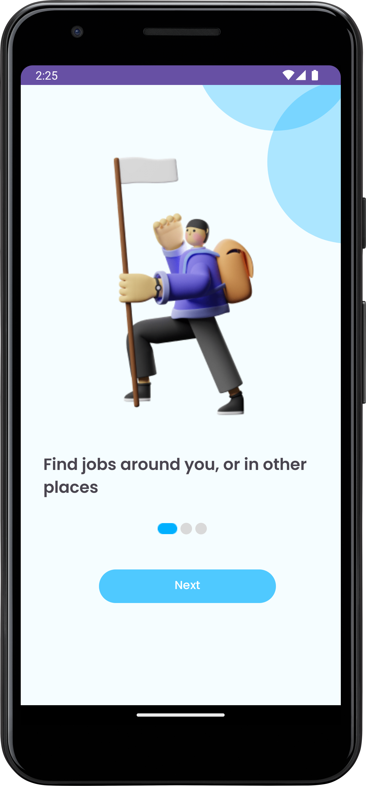
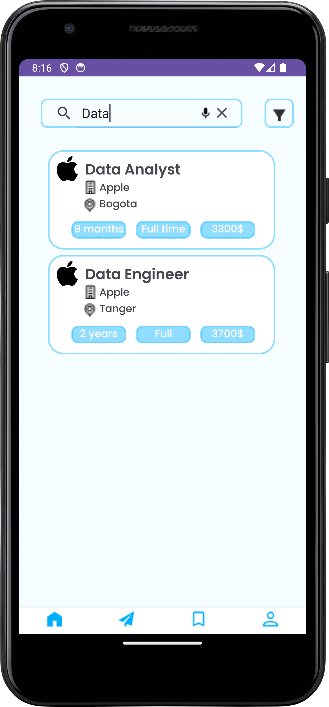
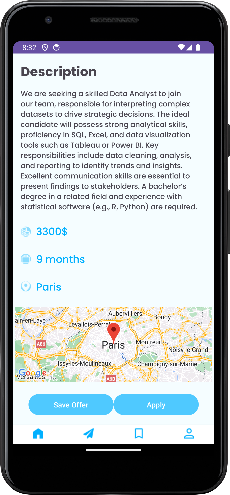
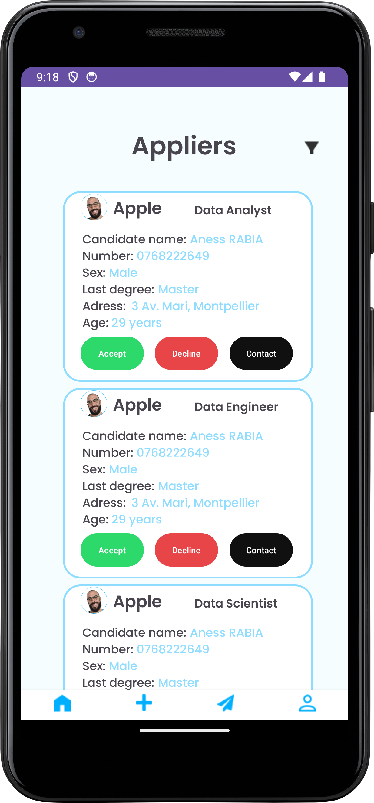

# Job Application Management Mobile App

Welcome to the Job Application Management Mobile App repository! This app is designed to streamline the process of job searching and application management for both job seekers and employers. Below is an overview of the app's features and functionalities.

## Features

### For Job Seekers:
1. **User Registration and Login:**
   - Create an account as a job seeker.
   - Login to access personalized features.

2. **Profile Management:**
   - Update profile information including photo, email, phone number, and CV.
   - Upload and update CV directly from the app.

3. **Job Search and Application:**
   - Search for job postings using keywords or voice search.
   - Apply filters such as city, salary, and contract type.
   - View detailed job descriptions and apply directly.
   - Save job offers for later reference.

4. **Application Tracking:**
   - Track the status of job applications (accepted, declined, pending).
   - View a summary of all applications and filter by status.

### For Employers:
1. **Company Registration and Login:**
   - Create an account as a company.
   - Login to manage job postings and applications.

2. **Profile Management:**
   - Update company profile information including logo, email, phone number, and address.

3. **Job Posting Management:**
   - Create and publish new job postings.
   - Modify or delete existing job postings.
   - View and manage applications for job postings.

4. **Application Management:**
   - View a list of applicants for each job posting.
   - Filter applicants by criteria such as sex, degree, and age.
   - Contact applicants via mobile, SMS, or email directly from the app.
   - View applicant details and CV.

## Technology Stack

- **Figma:** Used for creating design mockups and UI/UX design.
- **Firebase:** Used for backend services, including authentication, database management, and storage.

## Screenshots

### Introduction

### Home Page

### Job Description

### Applicant Management

## Usage

1. **Job Seekers:**
   - Register or log in to your account.
   - Update your profile and upload your CV.
   - Search for jobs and apply to the ones that match your skills.
   - Track the status of your applications.

2. **Employers:**
   - Register or log in to your company account.
   - Update your company profile.
   - Post new job offers and manage existing ones.
   - View and manage applications for your job postings.

## Contributing

We welcome contributions to improve this project! Please fork the repository and submit pull requests.

## License

This project is licensed under the MIT License.

## Contact

For any inquiries or issues, please contact [your email].

## Video Demonstration

For a video demonstration of the application, please visit our [YouTube channel](https://youtu.be/bI3Uye5aKjQ?si=JGKa4XLrI58WB7Ah).

---

Thank you for visiting our repository and contributing to the Job Application Management Mobile App!
